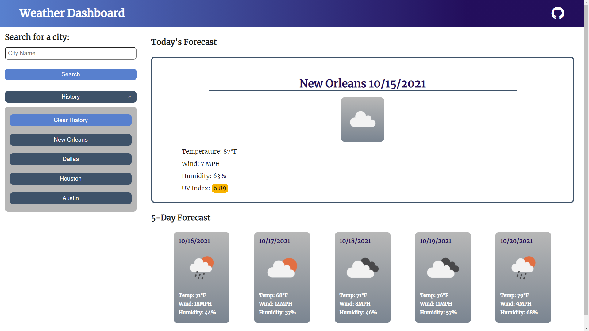
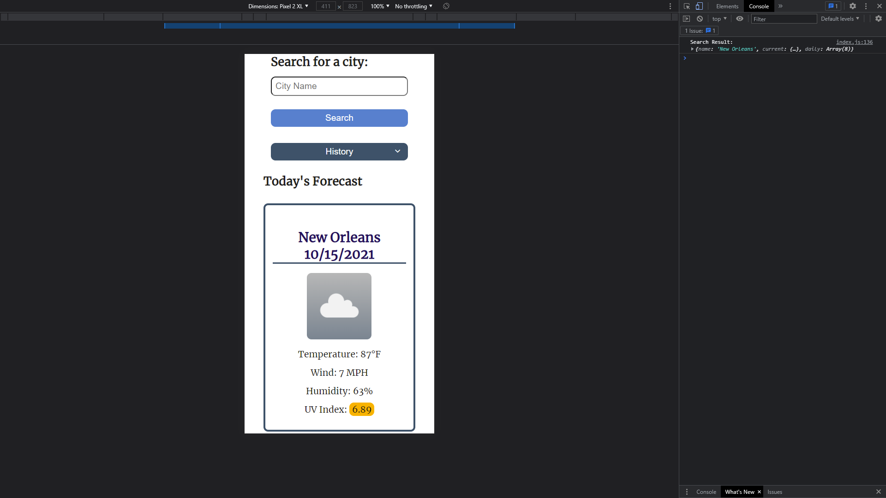

# SERVER-SIDE-API-CHALLENGE-weather-dashboard

This application was built utilizing the <a href="https://openweathermap.org/" target="_blank">Open Weather Map API</a>. Users are able to search for current and upcoming weather conditions by city.

The site was made entirely from scratch, using only one HTML file, one CSS file, and one vanilla Javascript file. It features animations and is fully mobile responsive. Local storage is utilized to save previous searches to a user's search history. These history items are clickable to quickly search for the cities you like to regularly check on.

Deployed site is viewable <a href="https://michael-rodriguez22.github.io/SERVER-SIDE-API-CHALLENGE-weather-dashboard/" target="_blank">here</a>. Enjoy!

---

---

